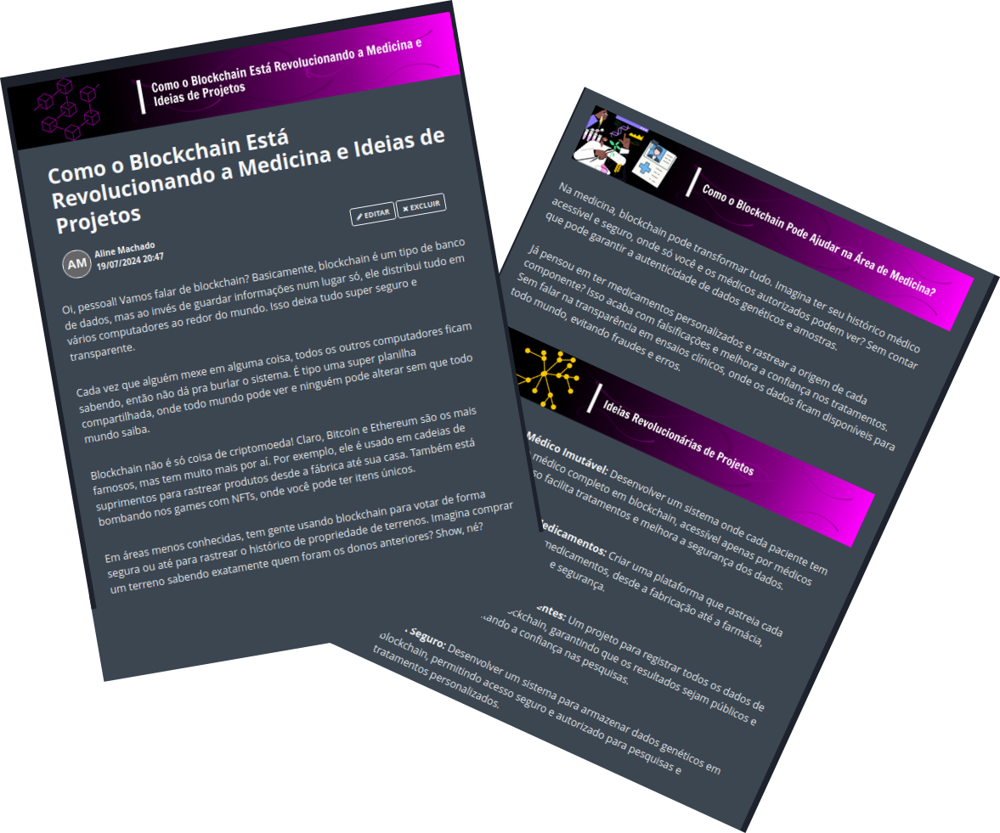

    

  
  

-------

  

# Projeto artigo técnico gerado por I.A.s

Projeto com o objetivo de gerar um artigo técnico com um layout rico, leitura agradável e com foco em promover a autoridade técnica.

<a href="https://web.dio.me/articles/como-o-blockchain-esta-revolucionando-a-medicina-e-ideias-de-projetos?back=%2Farticles&open-modal=true&page=1&order=oldest" title="View PDF now"> 📕Clique aqui para ler o artigo</a>

## 💻 Tecnologias utilizadas no projeto

- [ChatGPT](https://chat.openai.com/) - para título e conteúdo
- [Lexica.art](https://lexica.art/) - para gerar imagens
- [Canva](https://www.canva.com/) - para obter imagens
- [Inkscape] - Para formatação de banners e Layouts

## 📄 Prompts e ferramentas

ChatGPT：

|   Ação   | prompt                                                                                                                                                                                                                                                                         |
| :------: | ------------------------------------------------------------------------------------------------------------------------------------------------------------------------------------------------------------------------------------------------------------------------------ |
|  título  | Liste 5 sugestões de títulos para o artigo que acabamos de escrever                                                                                                                                                                                                    |
| conteúdo | eu quero que a partir de agora você seja um Arquiteto de Blockchain senior que fará um artigo para o linkedin: {REGRAS} use uma linguagem voltada para adolescentes, gamers ou jovens desenvolvedores;  o que é Blockchain?; em quais areas o Blockchain é utilizado? cite exemplos comuns e incomuns da utilizaçao dele; como o Blockchain pode nos ajudar na área de medicina e na de biotecnologia?; dê 6 sugestões totalmente diferenciadas e revolucionárias de ideias de projetos de mestrado nas áreas de medicina e na de biotecnologia. Descreva como seria a sua estratégia de desenvolvimento. As sugestões precisam ser altamente relevantes para a sociedade; cada paragrafo deve ter no máximo 5 linhas; faça um call to action para as minhas redes sociais; coloque tres hashtags que façam sentido |

Lexica.art：

- No léxica fiz uma busca sobre o termos como:

• Blockchain
• Technology
• Medical elements

Canva：

- No canva pesquisei elementos visuais com as palavras-chave:

• Blockchain
• Biotechnology
• Technology
• Medical elements
• Medicine

## ✨ Features

- Conteúdo gerado via ChatGPT
- Imagens do acervo público geradas via Lexica.art
- Imagens obtidas através do canva

## 📚 Materiais

- prompts utilizados

## 🛠️ Instruções de execução

Utilize os prompts acima nas ferramentas sugeridas para gerar o material base e utilize uma ferramenta de edição de documentos como power point, libreoffice , indesign para diagramação, o passo a passo em vídeo pode ser conferido na plataforma da [DIO](https://dio.me).

## 👨‍💻 Expert

    
    
&nbsp&nbsp&nbspAline de O. Machado 
    &nbsp&nbsp&nbsp
    <a href="https://github.com/alinemach">
    GitHub</a>&nbsp;|&nbsp;
    <a href="www.linkedin.com/in/alinemach">LinkedIn</a>
&nbsp;|&nbsp;

  

---

Feito com carinho por [Aline de O. Machado](https://github.com/alinemach)